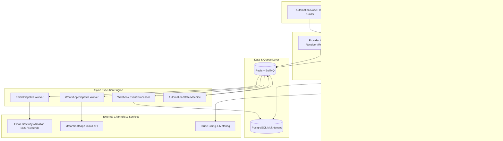
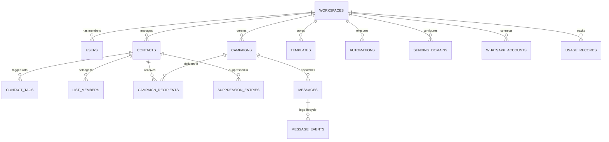

# Implementation Plan: Unified Email & WhatsApp Communication Platform

## Overview
This document outlines the complete architectural design, technology stack, database schema, module breakdown, and multi-phase implementation roadmap for the **Unified Email & WhatsApp Communication Platform** specified in the [Product Requirements Document](file:///d:/Poject/Unified%20Email%20&%20WhatsApp%20Communication%20Platform/Product%20Requirements%20Document.md) and styled after the reference design in [ref ui.jpg](file:///d:/Poject/Unified%20Email%20&%20WhatsApp%20Communication%20Platform/ref%20ui.jpg).

The platform is a multi-tenant SaaS communication suite that bridges email marketing and official WhatsApp Business Cloud messaging into a single, high-performance workspace.

---

## User Review Required

> [!IMPORTANT]
> **Key Architecture Decisions for Approval:**
> 1. **Monorepo vs Full-Stack Next.js**: We recommend a modern **Next.js 15 App Router (Full-Stack)** application with a dedicated background worker service (Node.js/TypeScript running BullMQ workers), or a modular monorepo (Turborepo) with `apps/web` (Next.js) and `apps/worker` (BullMQ message consumer). A unified monorepo ensures shared types, shared Prisma/Drizzle schema, and shared validation logic (Zod).
> 2. **WhatsApp Integration**: Official Meta Cloud API (Graph API v21.0+) directly or via Twilio/MessageBird. We recommend **Meta WhatsApp Cloud API directly** to eliminate per-message markup costs and provide native interactive templates & webhooks.
> 3. **Queue & Caching**: Redis (Upstash or self-hosted Redis) with **BullMQ** for reliable message dispatch, rate limiting, and webhook event streaming.
> 4. **Database & ORM**: PostgreSQL with **Prisma ORM** for strong type safety, automated migrations, and multi-tenant isolation.
> 5. **UI Aesthetic**: Modern glassmorphic bento-grid dashboard strictly adhering to [ref ui.jpg](file:///d:/Poject/Unified%20Email%20&%20WhatsApp%20Communication%20Platform/ref%20ui.jpg) (translucent frosted panels, pastel accent badges, radial speedometer gauges, time-ruler campaign scheduler, and smooth spline charts).

---

## System Architecture



---

## Reference UI Translation: Design Tokens & Components

Matching the visual language in [ref ui.jpg](file:///d:/Poject/Unified%20Email%20&%20WhatsApp%20Communication%20Platform/ref%20ui.jpg):

| UI Component in `ref ui.jpg` | Visual Style / Technical Implementation | Purpose in PRD |
| :--- | :--- | :--- |
| **Glassmorphism Panels** | `bg-white/80 backdrop-blur-xl border border-white/60 shadow-[0_8px_30px_rgb(0,0,0,0.04)] rounded-3xl` | Core bento-grid container cards |
| **Quick Actions** | 4 pastel rounded buttons (`bg-blue-50/70`, `bg-sky-50/70`, `bg-emerald-50/70`, `bg-rose-50/70`) with icons | Fast shortcuts: Create Campaign, Import Contacts, Design Template, View Reports |
| **Active Automations Card** | Journey progress indicators with step tags, bar fill percentage (`54%`, `27%`), dark pill CTA `Manage Automations` | Displays active automation workflows (PRD #42-45) |
| **Reputation Score Gauge** | 180° radial arc speedometer gauge with calibrated needle, `85.2% Good!` badge, green indicator pill | Account health, abuse monitoring, sender reputation (PRD #63, #83) |
| **KPI Metric Cards** | Top row cards with mini radial gauge (`Emails Sent 12,430`), mini 4-bar sparkline (`Open Rate 38.2%`), horizontal target range bar (`New Subscribers +1,248`) | High-level delivery and engagement stats (PRD #11) |
| **Campaign Performance Chart** | Multi-series curved spline area chart (Revenue, Click Rate, Unsubscribes) with hover tooltip (`Unsubscribes: 0.3%`) and date range toggle | Real-time campaign tracking (PRD #11, #32, #46) |
| **Deliverability Score** | `82/100` score with diagonal striped bar and status bullets (Spam complaints: Low, Bounce rate: Stable, Domain authentication: Verified) | Domain authentication (SPF/DKIM/DMARC) & inbox placement (PRD #33) |
| **Schedule Campaign Timeline** | Horizontal time ruler (`07:00` - `08:30`), "Today" indicator line, scheduled campaign pill badges (`Winter Sale Launch`, `New Arrivals Announcement`) | Interactive campaign calendar & scheduler (PRD #29, #37) |

---

## Multi-Tenant Database Schema (PostgreSQL)

All primary entities enforce tenant isolation with `workspace_id`.



### Core Schema Definition:
1. **Tenancy & Auth**:
   - `Workspace`: `id`, `name`, `slug`, `plan`, `settings`, `createdAt`
   - `User`: `id`, `email`, `name`, `passwordHash`, `avatarUrl`
   - `WorkspaceMember`: `workspaceId`, `userId`, `role` (`OWNER`, `ADMIN`, `MARKETING_MANAGER`, `STAFF`)
2. **Audience & Contacts**:
   - `Contact`: `id`, `workspaceId`, `email`, `phone`, `firstName`, `lastName`, `status` (`SUBSCRIBED`, `UNSUBSCRIBED`, `BOUNCED`), `customAttributes` (JSONB), `createdAt`
   - `Tag` & `ContactTag`: Categorization labels
   - `List` & `ListMember`: Static groupings
   - `Segment`: Dynamic rule definitions (JSONB filter criteria: rules, matchType `AND`/`OR`)
   - `SuppressionEntry`: `workspaceId`, `type` (`EMAIL_BOUNCE`, `EMAIL_UNSUB`, `SPAM_COMPLAINT`, `WA_OPT_OUT`), `value`
3. **Campaigns & Messaging**:
   - `Campaign`: `id`, `workspaceId`, `name`, `channel` (`EMAIL`, `WHATSAPP`, `UNIFIED`), `status` (`DRAFT`, `SCHEDULED`, `QUEUED`, `SENDING`, `COMPLETED`, `PAUSED`), `scheduledAt`, `templateId`, `segmentId`, `stats` (JSONB)
   - `CampaignRecipient`: `id`, `campaignId`, `contactId`, `channel`, `status`, `messageId`
   - `Message`: `id`, `workspaceId`, `campaignId`, `recipientId`, `channel`, `providerMessageId`, `status` (`QUEUED`, `SENT`, `DELIVERED`, `READ_OR_OPENED`, `CLICKED`, `FAILED`), `errorMessage`
   - `MessageEvent`: `id`, `messageId`, `eventType`, `timestamp`, `metadata` (IP, User-Agent, Link URL)
4. **Templates & Channels**:
   - `SendingDomain`: `workspaceId`, `domain`, `dkimStatus`, `spfStatus`, `dmarcStatus`, `verifiedAt`
   - `WhatsAppAccount`: `workspaceId`, `wabaId`, `phoneId`, `phoneNumber`, `status`, `accessTokenEncrypted`
   - `Template`: `workspaceId`, `channel`, `name`, `category`, `content` (JSONB block structure or WhatsApp template structure), `status`
5. **Automations & Workflows**:
   - `Automation`: `workspaceId`, `name`, `triggerType`, `triggerConfig`, `nodes` (JSONB), `edges` (JSONB), `status` (`ACTIVE`, `DRAFT`, `PAUSED`)
   - `AutomationExecution`: `id`, `automationId`, `contactId`, `currentNodeId`, `stateData`, `status`
6. **Metering & Billing**:
   - `Subscription`: `workspaceId`, `stripeCustomerId`, `stripeSubscriptionId`, `planId`, `status`
   - `UsageRecord`: `workspaceId`, `monthYear`, `emailsSent`, `waSent`, `contactCount`, `apiCalls`

---

## Proposed Changes & File Structure

We will implement this project in the root workspace `d:\Poject\Unified Email & WhatsApp Communication Platform`:

### Monorepo / Application Architecture
```text
├── apps/
│   ├── web/                         # Next.js 15 Full-Stack Application
│   │   ├── src/
│   │   │   ├── app/
│   │   │   │   ├── (auth)/          # Sign-in, Sign-up, Password Reset, Verify
│   │   │   │   ├── (dashboard)/     # Authenticated Dashboard Shell
│   │   │   │   │   ├── page.tsx     # Bento-Grid Dashboard (matching ref ui.jpg)
│   │   │   │   │   ├── contacts/    # Contacts, Lists, Segments, Import CSV
│   │   │   │   │   ├── campaigns/   # Unified / Email / WhatsApp Campaign Wizard
│   │   │   │   │   ├── templates/   # Template Manager & Visual Builder
│   │   │   │   │   ├── automations/ # Visual Workflow Journey Canvas
│   │   │   │   │   ├── channels/    # Domain DNS setup & WhatsApp Cloud API connection
│   │   │   │   │   ├── analytics/   # In-depth metrics, deliverability & reputation
│   │   │   │   │   ├── billing/     # Plan usage, Stripe tiers, quota meters
│   │   │   │   │   └── settings/    # Workspace, Team members, API keys, Webhooks
│   │   │   │   ├── api/             # REST Endpoints & Webhooks
│   │   │   │   │   ├── v1/          # Public API (/contacts, /campaigns, /messages)
│   │   │   │   │   └── webhooks/    # Ingest: Resend, Meta WhatsApp, Stripe
│   │   │   ├── components/
│   │   │   │   ├── dashboard/       # Bento cards, gauges, charts, schedule timeline
│   │   │   │   │   ├── QuickActionsCard.tsx
│   │   │   │   │   ├── ActiveAutomationsCard.tsx
│   │   │   │   │   ├── ReputationScoreGauge.tsx
│   │   │   │   │   ├── KpiCardsRow.tsx
│   │   │   │   │   ├── CampaignPerformanceChart.tsx
│   │   │   │   │   ├── DeliverabilityScoreCard.tsx
│   │   │   │   │   └── ScheduleCampaignTimeline.tsx
│   │   │   │   ├── ui/              # Glassmorphism primitives (Card, Badge, Button, Input)
│   │   │   │   ├── contacts/        # Data table, CSV mapper modal, segment filter builder
│   │   │   │   ├── campaigns/       # Multi-step wizard, variable preview, test sender
│   │   │   │   ├── templates/       # Email block editor & WhatsApp interactive preview
│   │   │   │   └── automations/     # Node graph editor (React Flow or custom SVG nodes)
│   │   │   ├── lib/
│   │   │   │   ├── db.ts            # Prisma Client singleton
│   │   │   │   ├── redis.ts         # Redis connection
│   │   │   │   ├── queue.ts         # BullMQ queue producers
│   │   │   │   ├── email/           # Email sender adapter (Resend / AWS SES)
│   │   │   │   ├── whatsapp/        # Meta Cloud API client & template sync
│   │   │   │   └── personalization.ts # {{variable | default:"fallback"}} template compiler
│   │   ├── package.json
│   │   └── tailwind.config.ts
│   └── worker/                      # Dedicated Background Worker Service (BullMQ)
│       ├── src/
│       │   ├── index.ts             # Worker runner & concurrency manager
│       │   ├── processors/
│       │   │   ├── email.ts         # Bulk email sender with rate limiting & backoff
│       │   │   ├── whatsapp.ts      # Meta WhatsApp API dispatcher
│       │   │   ├── import.ts        # Chunked CSV/XLSX streaming parser & validator
│       │   │   ├── webhooks.ts      # Webhook ingestion & analytics event updater
│       │   │   └── automation.ts    # Journey step scheduler & condition evaluator
│       └── package.json
├── packages/
│   ├── database/                    # Shared Prisma schema & migrations
│   │   ├── prisma/
│   │   │   └── schema.prisma
│   │   └── src/index.ts
│   └── config/                      # Shared TSConfig, ESLint
├── docker-compose.yml               # Local Postgres, Redis, Mailhog setup
└── README.md
```

---

## Detailed Implementation Roadmap (Sprints)

### Phase 1: Foundation & Design System (Sprint 1)
- [ ] Initialize repository with Turborepo (Next.js 15, TypeScript, Tailwind CSS, Lucide icons).
- [ ] Implement database schema with Prisma (PostgreSQL) and seed script.
- [ ] Set up Docker Compose for local PostgreSQL and Redis.
- [ ] Build Authentication & Multi-Tenancy session handling (NextAuth.js or JWT session cookie).
- [ ] Build the **exact Dashboard UI from `ref ui.jpg`**:
  - Frosted glassmorphism background & cards (`backdrop-blur-xl bg-white/80`).
  - `QuickActionsCard` with 4 pastel action buttons.
  - `KpiCardsRow` (Emails Sent arc gauge, Open Rate bar sparkline, New Subscribers range bar).
  - `CampaignPerformanceChart` (Spline curve with Recharts, dual-metric hover tooltips, 7d/30d filter).
  - `ReputationScoreGauge` (Speedometer arc needle with status pill).
  - `DeliverabilityScoreCard` (Score 82/100, striped status bar, bullet indicators).
  - `ScheduleCampaignTimeline` (Horizontal time ruler with scheduled pill blocks).
  - `ActiveAutomationsCard` with progress meters and dark action button.

### Phase 2: Audience & Contact Management (Sprint 2)
- [ ] Contact table with sorting, search, pagination, bulk actions, and custom fields.
- [ ] High-performance CSV/XLSX file upload with client preview and streaming chunk validator.
- [ ] Deduplication algorithm (by email and phone number) + syntax verification.
- [ ] Static Lists and Dynamic Segments builder (e.g. `tag == 'VIP' AND last_active < 30 days`).
- [ ] Suppression management (auto-suppress unsubscribes, bounces, spam complaints, WhatsApp STOP).

### Phase 3: Email Campaign & Domain Engine (Sprint 3 & 4)
- [ ] Sending Domain manager: DNS record generation (DKIM, SPF, DMARC) with one-click verification check.
- [ ] Drag-and-drop Block Email Builder + Raw HTML code editor with live responsive preview (Desktop/Mobile).
- [ ] Variable personalization engine supporting `{{first_name | default:"Customer"}}`, custom fields.
- [ ] Campaign creation wizard (Audience selection -> Channel selection -> Content -> Test Send -> Schedule/Send).
- [ ] BullMQ email dispatch worker with token bucket rate-limiting (e.g. 50/sec per domain).
- [ ] Tracking server: Open tracking 1x1 transparent GIF and click-redirect link wrapper.

### Phase 4: WhatsApp Business Engine (Sprint 5)
- [ ] Meta WhatsApp Cloud API credentials setup (WABA ID, Phone Number ID, Access Token encryption).
- [ ] WhatsApp Template synchronization (fetch approved Meta templates, language variants, components).
- [ ] WhatsApp Campaign creator with interactive variable mapping (`{{1}} -> {{first_name}}`, `{{2}} -> {{order_id}}`).
- [ ] Scheduled delivery & batch dispatch worker adhering to Meta messaging tier limits.
- [ ] Webhook receiver for Meta statuses (`sent`, `delivered`, `read`, `failed`) with auto-reconciliation.

### Phase 5: Automation Workflow Canvas (Sprint 6)
- [ ] Visual journey canvas (React Flow / interactive node editor):
  - Triggers: `Contact Subscribed`, `Tag Added`, `Form Submitted`, `Campaign Replied`.
  - Actions: `Send Email`, `Send WhatsApp`, `Add Tag`, `Wait Delay (X hours/days)`.
  - Conditions: `Email Opened?`, `Link Clicked?`, `Country == 'BD'`.
- [ ] State-machine execution engine running on BullMQ delayed jobs.

### Phase 6: SaaS Metering, Billing & Admin Control (Sprint 7 & 8)
- [ ] Usage metering counters (Email sent count, WhatsApp sent count, Contact limit).
- [ ] Stripe Checkout & Webhook handler for Free, Starter, Business, and Enterprise tiers.
- [ ] Quota guard middleware (blocking campaigns exceeding tier allowances with friendly upgrade modal).
- [ ] Superadmin dashboard: Workspace inspect, tenant suspension, abuse & spam complaint center.
- [ ] Public REST API (`/api/v1/contacts`, `/api/v1/campaigns/send`) with scoped API key authentication.

---

## Verification Plan

### Automated Tests
1. **Database Isolation Test**: Verify that Workspace A cannot query or mutate contacts/campaigns belonging to Workspace B.
2. **Variable Compiler Test**: Unit test the `{{variable | default:"fallback"}}` parser with missing keys, null values, and nested objects.
3. **Queue Idempotency Test**: Enqueue 100 duplicate message jobs and assert that exactly 1 message is sent per unique `(campaignId, contactId)`.
4. **CSV Parser Benchmark**: Process a 50,000-row sample CSV to ensure validation completes under 5 seconds with zero memory leaks.

### Visual & Manual Verification
1. **Reference UI Match**: Run the app locally and compare side-by-side with [ref ui.jpg](file:///d:/Poject/Unified%20Email%20&%20WhatsApp%20Communication%20Platform/ref%20ui.jpg):
   - Glassmorphism backdrop blur and card shadows.
   - Gauge accuracy and spline chart tooltips.
   - Schedule timeline ruler positioning and alignment.
2. **End-to-End Campaign Test**:
   - Import test contacts -> Create Email campaign -> Dispatch -> Verify delivery event simulation in dashboard analytics.
   - Connect simulated WhatsApp provider -> Send interactive template -> Trigger read receipt webhook -> Observe dashboard KPI update in real-time.
